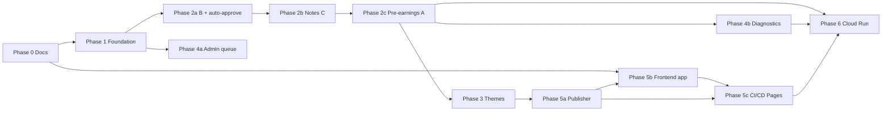
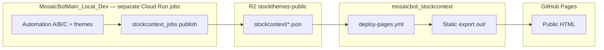

# MosaicBot Stock Context — Implementation Plan

**Parent spec:** [AUTOMATION_SPEC.md](AUTOMATION_SPEC.md)  
**Automation code repo:** `MosaicBotMain_Local_Dev` (admin_dashboard)  
**This repo:** `mosaicbot_stockcontext` (docs + static site)  
**Last updated:** 2026-06-02 (Phase 5b/5c live on GitHub Pages; Phase 6 Cloud Run + schedulers deployed)

Step-by-step build playbook. Each phase has objectives, dependencies, task IDs, file paths, acceptance criteria, and out-of-scope items.

---

## How to use

1. Complete phases **in order** unless noted “parallel.”
2. Check every acceptance box before starting the next phase.
3. Use `AUTOMATION_DRY_RUN=1` through Phase 1 and planning in 2a.
4. All automation writes use **same R2** paths as manual admin ([R2_PATHS.md](R2_PATHS.md)).

---

## Phase dependency graph



**Order:** `0 → 1 → 2a → 2b → 2c → 3` with `4a` parallel to late `2c` → `4b → 5a → 5b → 5c → 6`.

**Public site deploy (like stockthemes):** MosaicBot publishes JSON to R2 → this repo’s GitHub Action builds static HTML → GitHub Pages. See [Phase 5c](#phase-5c--cicd--github-pages).

---

## Phase 0 — Docs, schemas & conventions

| | |
|---|---|
| **Objective** | Freeze JSON/R2 contracts before automation writes production data. |
| **Depends on** | Nothing. |
| **Duration hint** | 0.5–1 day |

### Tasks

| ID | Task | Deliverable | Done |
|----|------|-------------|------|
| 0.1 | Product spec | `docs/AUTOMATION_SPEC.md` | ✅ |
| 0.2 | Implementation plan | `docs/IMPLEMENTATION_PLAN.md` | ✅ |
| 0.3 | R2 paths + locked CDN | `docs/R2_PATHS.md` | ✅ |
| 0.4 | Status enums | `docs/STATUS_ENUMS.md` | ✅ |
| 0.5 | Cloud Run schedule | `docs/CLOUD_RUN.md` | ✅ |
| 0.6 | JSON schemas | `docs/schemas/*.schema.json` (8 files) | ✅ |
| 0.7 | Examples | `docs/examples/**/*.example.json` | ✅ |
| 0.8 | Public prefix | `https://storage.stockthemes.ai/stockcontext/` on `stockthemes-public` | ✅ |
| 0.9 | MosaicBot `CLAUDE.md` link | Optional — skipped per preference | — |

### Acceptance criteria

- [x] Publisher and frontend can be built from schemas without reading Python.
- [x] STATUS_ENUMS lists illegal transitions (e.g. `c_status: done` → `running` forbidden).

### Out of scope

- Python modules, Cloud Run deploy, admin UI.

---

## Phase 1 — Foundation (universe, state, queue, budget)

| | |
|---|---|
| **Objective** | Shared libraries for all jobs; **no LLM** except reading spend. |
| **Depends on** | Phase 0. |
| **Code repo** | `MosaicBotMain_Local_Dev` |
| **Duration hint** | 3–5 days |

### 1.1 Sheet & universe loaders ✅

**Create:** `admin_dashboard/utils/portfolio_watchlist_universe.py`

| ID | Task | Done |
|----|------|------|
| 1.1.1 | `PORTFOLIO_GID=334674095`, `WATCHLIST_THEMES_GID=1801228893` — **no Watchlist_Updates** | ✅ |
| 1.1.2 | `load_portfolio_holdings()` → theme, ticker, weight, notes | ✅ |
| 1.1.3 | `load_portfolio_theme_names()` / `load_watchlist_theme_names()` | ✅ |
| 1.1.4 | `build_tier_map()` → tier 1/2/3 per spec | ✅ |
| 1.1.5 | `get_weight(ticker)`, `get_market_cap_usd(ticker)` | ✅ |

**Refactor:** `admin_dashboard/utils/pre_earnings_utils.py` — `get_portfolio_themes()`, `get_watchlist_coverage_themes()`; deprecated `get_watchlist_themes()` → portfolio tab; universe via tiers 1–3.

**Tests:** `tests/admin_dashboard/test_portfolio_watchlist_universe.py`

**CLI:** `scripts/print_automation_universe.py` (live verified: ~897 universe tickers).

### 1.2 Earnings calendar (snapshot-only) ✅

**Create:** `admin_dashboard/utils/earnings_automation_calendar.py`

| ID | Task | Done |
|----|------|------|
| 1.2.1 | `get_upcoming_for_universe(days=14)` from `upcoming_earnings_latest` | ✅ |
| 1.2.2 | `get_reported_for_universe(lookback_days=30)` from `recent_earnings_latest` | ✅ |
| 1.2.3 | `resolve_bmo_amc()` — enriched snapshot / row / earnings_dates_history | ✅ |
| 1.2.4 | `compute_notes_eligible_close_date()` + `compute_notes_eligible_date()` — T+2 + Fri rules | ✅ |

**Tests:** `tests/admin_dashboard/test_notes_eligible_date.py`

**CLI:** `scripts/print_automation_calendar.py`

### 1.3 State & ledgers ✅

**Create:** `admin_dashboard/utils/earnings_automation_state.py`

| R2 path | Purpose |
|---------|---------|
| `text_tables/Earnings_Automation_State.parquet` | Cycle state |
| `text_tables/Transcript_Completion_Ledger.parquet` | Dedup B |
| `text_tables/Automation_Queues.parquet` | pre / post / theme_event |

| ID | Task | Done |
|----|------|------|
| 1.3.1 | `upsert_cycle`, `transition`, `cancel_a_when_b_starts` | ✅ |
| 1.3.2 | Ledger: `mark_pre/post_transcript_complete`, `is_*_complete`, `reset_ledger_flags` | ✅ |
| 1.3.3 | Queue: `enqueue_item`, `list_queue`, `dequeue_item`, `clear_queue` | ✅ |
| 1.3.4 | `sync_cycles_from_calendar()` — idempotent seed from 1.2 | ✅ |

**Tests:** `tests/admin_dashboard/test_earnings_automation_state.py`

**CLI:** `scripts/sync_automation_state.py` (respects `AUTOMATION_DRY_RUN=1`)

### 1.4 Queue ranker ✅

**Create:** `admin_dashboard/utils/earnings_automation_queue.py`

| ID | Task | Done |
|----|------|------|
| 1.4.1 | Rank: tier → weight ↓ → older date ↑ → mcap ↓ | ✅ |
| 1.4.2 | `select_batch`, `enqueue_overflow`, `weekend_drain` (A + B) | ✅ |

**Tests:** `tests/admin_dashboard/test_queue_ranker.py`

**CLI:** `scripts/print_automation_queue.py --type pre|post [--cap 20] [--midday] [--weekend-drain]`

### 1.5 Budget & config ✅

**Create:** `admin_dashboard/utils/automation_budget.py`, `admin_dashboard/config_automation.py`

| ID | Task | Done |
|----|------|------|
| 1.5.1 | `remaining_budget()`, `can_afford()`, `record_automation_spend()` — daily cap **$20** (default) via `Automation_Gemini_Daily_Spend.parquet`; monthly context from `Gemini_Spending.parquet` | ✅ |
| 1.5.2 | `load_automation_config()` — all `AUTOMATION_*` env vars | ✅ |

**Tests:** `tests/admin_dashboard/test_automation_budget.py`

**CLI:** `scripts/print_automation_budget.py`

### 1.6 CLI (no LLM)

- `admin_dashboard/scripts/print_automation_universe.py`
- `admin_dashboard/scripts/print_automation_queue.py --type pre|post --cap 20`

### Phase 1 gate

- [ ] CLIs print tiers and ranked queue.
- [ ] State parquets round-trip on dev R2.
- [ ] Unit tests pass.

---

## Phase 2a — Auto-approve + Process B ✅

| | |
|---|---|
| **Status** | **Complete** (2026-06-01) |
| **Objective** | Post-earnings transcript + earnings results; dedup; caps; parallel×3. |
| **Depends on** | Phase 1 |

### Tasks

| ID | Task | Location | Status |
|----|------|----------|--------|
| 2a.1 | `auto_approve_update` / `save_and_auto_approve` | `llm_thesis_updates.py` | ✅ |
| 2a.2 | `POST_EARNINGS_RECIPE` without `transcript_notes` | `config_automation.py` | ✅ |
| 2a.3 | Guard notes in `upload_transcript` when automation B | `document_manager.py` | ✅ |
| 2a.4 | `run_post_earnings.py` — plan, FMP check, batch×3, ledger, caps 20/10 | `admin_dashboard/automation/` | ✅ |
| 2a.5 | 30d → `abandoned` | `earnings_automation_state.py` | ✅ |
| 2a.6 | `pre_earnings_table_policy.py` — 150d table rules | moved to **Phase 2c** | ✅ (2c) |

**CLI:** `scripts/run_post_earnings_automation.py` (`--live`, `--cap`, `--ticker`, `--midday`)

**Live validation:** NVDA 2026-05-20 — Process B success; 9/10 full-analysis tables ( `Ticker_EarningsResults` skipped — no `Ticker_ReratingThresholds` within 60d; intentional).

### Phase 2a gate

- [x] One B ticker → full-analysis tables in R2; **no** `Ticker_Notes` same run.
- [x] Re-run skipped via ledger (`post_transcript_complete=Y`).
- [x] Cap / overflow queue wired (`select_batch("post")`, 21st stays queued).
- [x] Manual Post-Earnings tab unchanged; PET enrichment shows **Done (auto)**.

---

## Phase 2b — Process C (~3 AM ET) ✅

| | |
|---|---|
| **Status** | **Complete** (2026-06-01) |
| **Objective** | T+2 calendar `Ticker_Notes`; independent of late transcript. |
| **Depends on** | 2a, Phase 1 calendar |

| ID | Task | Status |
|----|------|--------|
| 2b.1 | `get_notes_return_window()` — `market_performance_utils.py` | ✅ |
| 2b.2 | `run_earnings_notes.py` — cap 40, budget | ✅ |
| 2b.3 | Wait for B if in post queue same session | ✅ |
| 2b.4 | `c_status=done` terminal — no re-run on late B | ✅ |
| 2b.5 | *(Optional)* Staging race fix — `RLock` + reload on `approve_update` | ✅ |
| 2b.6 | `build_notes_candidates` + `select_batch("notes")` | ✅ |

**CLI:** `scripts/run_earnings_notes_automation.py`; `print_automation_queue.py --type notes`

**Tests:** `tests/admin_dashboard/test_earnings_notes_automation.py`, `test_notes_eligible_date.py`

**Live validation:** NVDA 2026-05-20 — `content_source: transcript`, `Ticker_Notes` → R2 + Google Sheets, `c_status=done`, automation spend ~$0.0096.

### Phase 2b gate

- [x] Edge-case dates pass tests.
- [x] NVDA live: transcript note → R2 + Sheets; `c_status=done`; budget recorded (~$0.01).
- [x] No duplicate note when B completes after C (`c_status=done` terminal).

---

## Phase 2c — Process A (pre-earnings, night only) ✅

| | |
|---|---|
| **Status** | **Complete** (2026-06-01) |
| **Objective** | 14d window; 20 cap; B cancels A; parallel×3. |
| **Depends on** | 2a |

| ID | Task | Location | Status |
|----|------|----------|--------|
| 2c.1 | `run_pre_earnings.py` — night batch only | `admin_dashboard/automation/` | ✅ |
| 2c.2 | Enter window when date moves into 14d | `build_pre_candidates` / calendar | ✅ |
| 2c.3 | Table policy + prior transcript if ledger incomplete | `pre_earnings_table_policy.py`, pipeline | ✅ |
| 2c.4 | `trigger=manual` exempt from auto-cancel | `earnings_automation_state.py` | ✅ |
| 2c.5 | Cap 20 + queue + weekend drain | existing queue + CLI | ✅ |

**CLI:** `scripts/run_pre_earnings_automation.py` (`--live`, `--cap`, `--ticker`, `--days`)

**Tests:** `tests/admin_dashboard/test_pre_earnings_automation.py`

**Live validation:** PL 2026-06-04 — stale full refresh; prior FMP transcript + rerating thresholds; `a_status=done`; `pre_transcript_complete` set.

### Phase 2c gate

- [x] B cancels A for same cycle (`cancel_a_when_b_starts`; manual trigger exempt).
- [x] Stale tables include Detailed Overview; fresh → 3-table subset (+ thresholds always).
- [x] Ledger-complete tickers stay in queue for thresholds-only reruns.
- [x] Queue FIFO across nights (existing `select_batch("pre")` + overflow).

---

## Phase 3 — Theme updates (T1 + T2) ✅

| | |
|---|---|
| **Status** | **Complete** (2026-06-01) |
| **Objective** | 5+5 themes/day; default theme; Theme_Notes quarter dedup; Theme Composer context. |
| **Depends on** | 2a |

| ID | Task | Status |
|----|------|--------|
| 3.1 | `resolve_theme_for_ticker()` — port → watchlist → default → newest | ✅ |
| 3.2 | `Ticker_Default_Theme.parquet` + loader (admin tab → Phase 4a) | ✅ |
| 3.3 | `filter_theme_notes_for_llm_context()` — latest auto note per quarter | ✅ |
| 3.4 | `run_theme_updates.py` — T1 after B enqueue; T2 rotation | ✅ |
| 3.5 | `Theme_Refresh_State.parquet` | ✅ |

**Context:** Theme Composer–style context + `gemini-3-flash` web search + auto-approve.

**Schedule:** B only *records* `Theme_T1_Pending` (one row per theme for ranking). Nightly theme job uses **90d summaries for all constituents** + theme/ticker tables + web search — **not** one ticker's full transcript.

**CLI:** `scripts/run_theme_updates_automation.py` (`--live`, `--t1-cap`, `--t2-cap`, `--t1-only`, `--t2-only`)

**Tests:** `tests/admin_dashboard/test_theme_automation.py`

### Phase 3 gate

- [x] 6th event theme queued with tier priority (`theme_event` overflow queue).
- [x] T2 never picks port/watchlist theme names.
- [x] Quarter dedup in Theme_Notes prompt context.

---

## Phase 4a — Admin automation queue ✅

| | |
|---|---|
| **Status** | **Complete** |
| **Parallel with** | Late 2c |

| ID | Task |
|----|------|
| 4a.1 | Top-level **Automation Ops** tile; **Queue** tab (moved out of Ticker Management) ✅ |
| 4a.2 | Grids: pre/post/theme queues + state table ✅ |
| 4a.3 | Actions: reset ledger, force re-queue, cancel ✅ |
| 4a.4 | Manual jobs `trigger=manual`; parallel×3 ✅ *(manual runs live in Pre/Post tools; queue tab focuses on orchestration)* |

### Phase 4a gate

- [x] Backlog and tonight’s cap visible.
- [x] Theme queues (T1/T2) visible with preview refresh path.
- [x] Manual pre/post ordering (↑/↓ + Save) persists to R2 overrides.

---

## Phase 4b — Diagnostics + LLM tile ✅

| | |
|---|---|
| **Status** | **Complete** |

| ID | Task |
|----|------|
| 4b.0 | **Automation Ops** tile hosts Queue (4a ✅) + Diagnostics tab (4b) ✅ |
| 4b.1 | Diagnostics tab (`automation_diagnostics.py` + utils) ✅ |
| 4b.2 | Spend vs daily cap; failures; abandoned; today's spend ledger (**read-only**) ✅ |
| 4b.3 | LLM tile shortcut → Recent Actions tab; manual-trigger count on diagnostics ✅ |
| 4b.4 | **Editable** daily Gemini cap in Automation Ops → Diagnostics (`Automation_Config.parquet` on R2; env default fallback) ✅ |

### Phase 4b gate

- [x] Last night errors visible (recent failures ~36h + full failed list).
- [x] Spend vs cap visible (read-only OK for v1).

---

## Phase 5a — Publisher

| | |
|---|---|
| **Status** | **Core complete** (2026-06-02) — 827 tickers, 1279 table bodies, 95 themes on CDN |
| **Code** | `MosaicBotMain_Local_Dev` — `stockcontext_jobs/publish_stockcontext.py` (standalone Cloud Run job) |
| **Output** | See [R2_PATHS.md](R2_PATHS.md) |

| ID | Task |
|----|------|
| 5a.1 | manifest, search_index, home feeds, **themes/index** ✅ |
| 5a.2 | Per-ticker meta, table bodies from R2 text tables ✅; chart_1y + financials **placeholders** |
| 5a.3 | Theme `meta.v0.json` with pre-baked constituents → ticker links ✅ |
| 5a.4 | `stockcontext_jobs/` package + `publish_stockcontext.py` Cloud Run job ✅ |
| 5a.5 | `--mode full \| incremental` + `_publish_state.v0.json` fingerprints ✅ |
| 5a.6 | Cloud Run publish job + **6 AM ET** scheduler ✅ (`stockcontext-publish-job`) |
| 5a.7 | Chart/financials enrichment from market data | **Deferred** |
| 5a.8 | Midday incremental publish after post-B | **Deferred** (spec ~4 AM + post-midday B; only 6 AM daily wired) |
| 5a.9 | Rich home feeds (top movers, watchlist, recent notes) | **Deferred** (v0: 24-ticker “Coverage universe” slice only) |

### Phase 5a gate

- [x] NVDA bundle &lt;100KB without table bodies (~3.4 KB verified on CDN).
- [ ] Automated schema validation in publish CI (schemas exist; jsonschema gate not wired).
- [x] Publisher writes `stockcontext/` tree including themes + tickers (827 live on CDN).

---

## Phase 5b — Frontend app (this repo)

| | |
|---|---|
| **Status** | **v0 complete, live** — [GitHub Pages](https://tmccode.github.io/MosaicBot_StockContext/) |
| **Repo** | `mosaicbot_stockcontext` |
| **Deploy** | Phase [5c](#phase-5c--cicd--github-pages) |

| ID | Task |
|----|------|
| 5b.1 | Next.js static export (`out/`) ✅ |
| 5b.2 | Home + `/ticker/[symbol]` + `/theme/[slug]`; text tables baked from cache ✅ |
| 5b.3 | Build reads `.cache/stockcontext-public` only (no live CDN in prod) ✅ |
| 5b.4 | No sign-in v1 ✅ |
| 5b.5 | `generateStaticParams` from manifest for all ticker/theme pages ✅ |
| 5b.6 | Search bar (fuse.js + `search_index.v0.json`) ✅ |
| 5b.7 | `/tickers` browse-all with filter ✅ |
| 5b.8 | UI polish (stockthemes design, tier badges, table accordions, mobile LCP) | **Deferred** |

### Phase 5b gate

- [ ] Mobile LCP &lt;2.5s repeat visit (827 static pages — tune later).
- [x] App builds with `npm run build` using baked/synced public JSON.
- [x] Live site shows real manifest (`build_id=20260602T142234`, 827 tickers) not example seed.

---

## Phase 5c — CI/CD & GitHub Pages ✅

| | |
|---|---|
| **Status** | **Complete** (2026-06-02) — first full deploy ~16 min (CDN sync + 827 pages) |
| **Objective** | Push to `main` (and scheduled runs) rebuild the static site and deploy to GitHub Pages — same operational model as **`mosaicbot_stockthemes`**. |
| **Live URL** | https://tmccode.github.io/MosaicBot_StockContext/ |
| **Depends on** | Phase 5b (minimal app that builds); Phase 5a (publisher writing `manifest.v0.json` to R2) for meaningful skip-if-unchanged behavior. |
| **Reference impl** | `mosaicbot_stockthemes/.github/workflows/deploy-pages.yml`, `scripts/ci-should-build.mjs`, `scripts/sync-public-json-ci.mjs` |

### Two-repo pipeline (mirror stockthemes)



| Step | What happens |
|------|----------------|
| 1 | Nightly Cloud Run (Phase 6) runs `publish_stockcontext` → writes `stockcontext/manifest.v0.json`, tickers, feeds, etc. |
| 2 | GitHub Action in **this repo** syncs public JSON from R2 into build cache (ETag-aware). |
| 3 | `npm run build` produces static export; optional bake of manifest/home into HTML. |
| 4 | `actions/deploy-pages@v4` publishes `out/` to GitHub Pages. |

**Not in this repo:** LLM automation, admin UI, or publisher Python — those stay in MosaicBot.

### Tasks — `mosaicbot_stockcontext`

| ID | Task | Deliverable |
|----|------|-------------|
| 5c.1 | Enable GitHub Pages | Repo **Settings → Pages → Build and deployment: GitHub Actions** ✅ |
| 5c.2 | Deploy workflow | `.github/workflows/deploy-pages.yml` ✅ |
| 5c.3 | Skip unchanged data | `scripts/ci-should-build.mjs` ✅ |
| 5c.4 | CDN sync for CI | `scripts/sync-stockcontext-ci.mjs` — ETag-aware; full ticker bundles (meta + tables/index + bodies); cache key `stockcontext-public-v4`; `STOCKCONTEXT_SYNC_VIA_CDN=1` in CI ✅ |
| 5c.5 | Deploy meta | `scripts/write-pages-deploy-meta.mjs` ✅ |
| 5c.6 | Build env | `NEXT_PUBLIC_BASE_PATH=/MosaicBot_StockContext`, CDN base URL ✅ |
| 5c.7 | Secrets | GitHub **Secrets**: `R2_*` (optional — CI uses public CDN sync) ✅ |
| 5c.8 | Permissions | `contents: read`, `pages: write`, `id-token: write`; `environment: github-pages` ✅ |
| 5c.9 | Triggers | `push` to `main`, daily schedule (~06:45 ET), `workflow_dispatch` + `force_build` ✅ |
| 5c.10 | Concurrency | `stockcontext-pages`, `cancel-in-progress: false` ✅ |
| 5c.11 | Docs | `docs/CI_CD.md` ✅ |
| 5c.12 | Prebuild guard | Do not re-seed examples when cache exists; fail CI on `example-local-001` ✅ |

### Tasks — `MosaicBotMain_Local_Dev` (publisher deploy)

| ID | Task | Deliverable |
|----|------|-------------|
| 5c.12 | Publish job image | `Dockerfile.stockcontext-publish` (or reuse automation image with entrypoint) |
| 5c.13 | GH Action deploy job | `.github/workflows/deploy-stockcontext-publish.yml` → `stockcontext-publish-job` ✅ |
| 5c.14 | Publish scheduler | Cloud Scheduler **6 AM ET** → `stockcontext-publish-job` ✅ |
| 5c.15 | Chain order | Publish 6 AM ET → Pages ~6:45 AM ET (documented in [CLOUD_RUN.md](CLOUD_RUN.md)) ✅ |

### GitHub configuration checklist

| Item | Where | Notes |
|------|--------|------|
| Pages source | `mosaicbot_stockcontext` → Settings → Pages | Source = **GitHub Actions** |
| Custom domain | Optional | e.g. `stockcontext.ai` CNAME → `{user}.github.io` or org Pages URL |
| `DATA_BASE_URL` | Repository **Variables** | `https://storage.stockthemes.ai/stockcontext/` |
| R2 credentials | Repository **Secrets** | Same R2 bucket as stockthemes; prefix `stockcontext/` only |
| `github-pages` environment | Repo Environments | Required for `deploy-pages@v4` |

### Phase 5c gate

- [x] Push to `main` on `mosaicbot_stockcontext` triggers Action and updates live GitHub Pages URL.
- [x] `workflow_dispatch` with `force_build=true` rebuilds even when `as_of` unchanged.
- [ ] Scheduled run skips build when `manifest.v0.json` `as_of` matches last deploy meta (verify after first nightly cycle).
- [x] MosaicBot `deploy-stockcontext-publish.yml` deploys Cloud Run publish job (`6650889`).
- [ ] End-to-end unattended: automation → publish → Pages (first cycle **2026-06-03** midnight ET).

### Out of scope (5c v1)

- Preview deployments per PR (optional later).
- Cloudflare purge for `stockcontext/` (add if CDN serves stale HTML; JSON already versioned via `build_id` / paths).
- Monorepo combining MosaicBot + stockcontext in one Action.

---

## Phase 6 — Cloud Run + schedulers

| | |
|---|---|
| **Status** | **Deployed** (2026-06-02) — awaiting first unattended nightly cycle |

See [CLOUD_RUN.md](CLOUD_RUN.md) and [CI_CD.md](CI_CD.md).

| ID | Task | Status |
|----|------|--------|
| 6.1 | Automation image + **5** Cloud Run jobs | ✅ `deploy-stockcontext-automation.yml` (MosaicBot `6650889`) |
| 6.2 | Publish job | ✅ `deploy-stockcontext-publish.yml` |
| 6.3 | Cloud Scheduler (midnight / 00:30 / 3a / 5a / noon ET) | ✅ `setup_stockcontext_automation_schedulers.sh` run locally |
| 6.4 | Publish scheduler (6 AM ET) | ✅ `setup_stockcontext_publish_scheduler.sh` run locally |
| 6.5 | GitHub Pages deploy | ✅ `mosaicbot_stockcontext/deploy-pages.yml` |

**Cloud Run jobs (us-central1):** `stockcontext-pre-earnings`, `stockcontext-post-transcript-night`, `stockcontext-post-transcript-midday`, `stockcontext-earnings-notes`, `stockcontext-theme-updates`, `stockcontext-publish-job`.

**Storage:** All object data on **R2** (private `mosaic-themes`, public `stockthemes-public`). GCP used for Cloud Run + Scheduler + Cloud Build only.

### Phase 6 gate

- [x] Run deploy workflows on `main` (first image push).
- [x] Run scheduler setup scripts once (`gcloud` authenticated).
- [ ] Staging week: B → C → themes → publish without manual clicks (starts **2026-06-03** midnight ET).
- [ ] Midday B skipped when queue empty.
- [ ] Stops at daily Gemini cap (default $20).

---

## Master checklist

| Phase | Gate |
|-------|------|
| 0 | ✅ Schemas + examples + R2 URL locked |
| 1 | CLI + tests (MosaicBot) — core libs ✅; formal gate open |
| 2a | ✅ B auto-approved (NVDA live) |
| 2b | ✅ T+2 notes (NVDA live) |
| 2c | ✅ Pre-earnings + queue (PL live) |
| 3 | ✅ Themes T1+T2 (Composer context + web search) |
| 4a | ✅ Queue UI |
| 4b | ✅ Diagnostics (+ editable daily cap) |
| 5a | ✅ CDN JSON live (827 tickers); chart/financials + rich feeds deferred |
| 5b | ✅ Frontend v0 live (search + browse); UI polish deferred |
| 5c | ✅ CI/CD → GitHub Pages |
| 6 | ✅ Crons deployed; first unattended night pending |

### Deferred / next

| Item | Phase |
|------|--------|
| Chart/financials enrichment + frontend charts | 5a.7 / 5b |
| Midday incremental publish | 5a.8 |
| Rich home feed sections (top movers, watchlist, recent notes) | 5a.9 |
| UI design pass, mobile LCP | 5b.8 |
| Automated schema validation in publish CI | 5a gate |
| Verify unattended E2E + skip-if-unchanged Pages | 5c / 6 gates |

---

## New files (mosaicbot_stockcontext)

```
.github/workflows/
  deploy-pages.yml
app/
  page.tsx, layout.tsx, tickers/page.tsx
  ticker/[symbol]/page.tsx, theme/[slug]/page.tsx
components/
  SearchBox.tsx, TickerBrowse.tsx, TableSection.tsx
scripts/
  ci-should-build.mjs
  sync-stockcontext-ci.mjs      # CDN/R2 sync; ticker bundle walk
  write-pages-deploy-meta.mjs
lib/
  data.ts, links.ts, types.ts
docs/
  CI_CD.md
.cache/stockcontext-public/   # CI + local dev — gitignored
```

## New files (MosaicBotMain_Local_Dev)

```
stockcontext_jobs/                 # Standalone Cloud Run jobs (NOT admin UI, NOT FetchEODData/run.py)
  README.md
  publisher.py
  publish_stockcontext.py
  run_pre_earnings.py
  run_post_transcript.py
  run_earnings_notes.py
  run_theme_updates.py
.github/workflows/
  deploy-stockcontext-automation.yml
  deploy-stockcontext-publish.yml
Dockerfile.stockcontext-automation
Dockerfile.stockcontext-publish
cloudbuild-stockcontext-automation.yaml
cloudbuild-stockcontext-publish.yaml
scripts/setup_stockcontext_automation_schedulers.sh
scripts/setup_stockcontext_publish_scheduler.sh
scripts/publish_stockcontext.py    # CLI wrapper
admin_dashboard/tools/             # Phase 4a/4b (Automation Ops)
  automation_queue.py
  automation_ops.py
  automation_diagnostics.py
admin_dashboard/utils/
  automation_admin_actions.py
  automation_config_store.py
  automation_diagnostics.py
  automation_queue_overrides.py
tests/stockcontext_jobs/
  test_publisher.py
```

---

## Environment variables

| Variable | Default | Purpose |
|----------|---------|---------|
| `AUTOMATION_GEMINI_DAILY_CAP_USD` | `20` | Daily LLM cap |
| `AUTOMATION_PRE_CAP` | `20` | Pre-earnings / night |
| `AUTOMATION_POST_CAP_NIGHT` | `20` | Post night |
| `AUTOMATION_POST_CAP_MIDDAY` | `10` | Post midday |
| `AUTOMATION_NOTES_CAP` | `40` | Notes / 3 AM |
| `AUTOMATION_THEME_EVENT_CAP` | `5` | T1 |
| `AUTOMATION_THEME_ROTATION_CAP` | `5` | T2 |
| `AUTOMATION_PRE_PARALLEL` | `3` | Concurrent pre |
| `AUTOMATION_POST_PARALLEL` | `3` | Concurrent post |
| `AUTOMATION_STALE_TABLE_DAYS` | `150` | 5-month rule |
| `AUTOMATION_TRANSCRIPT_MAX_AGE_DAYS` | `30` | Abandon B |
| `AUTOMATION_THEME_ROTATION_DAYS` | `180` | T2 eligibility |
| `AUTOMATION_DRY_RUN` | `0` | Plan only |

### Stock Context site (Phase 5b / 5c — `mosaicbot_stockcontext`)

| Variable | Example | Purpose |
|----------|---------|---------|
| `DATA_BASE_URL` | `https://storage.stockthemes.ai/stockcontext/` | CDN prefix for runtime + build |
| `SITE_URL` | `https://{org}.github.io/stockcontext/` | Canonical site URL (or custom domain) |
| `BASE_PATH` | `/stockcontext/` or `/` | GH Pages subpath if not apex domain |
| `STOCKCONTEXT_SYNC_VIA_CDN` | `1` | Local/CI: sync public JSON from CDN (no R2 secrets) |
| `STOCKCONTEXT_SYNC_VIA_R2` | `1` | CI alt: sync via R2 API |
| `STOCKCONTEXT_BUILD_CACHE` | `1` | Use `.cache/stockcontext-public` during build |
| `STOCKCONTEXT_STATIC_PAGES` | `1` | Static export mode (Next/Vite) |
